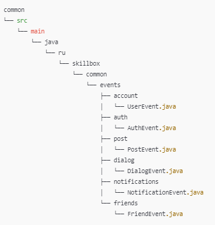

# Common Module

## Описание

Модуль `common` содержит события Kafka, используемые в различных микросервисах приложения **Network**.

---

### Установка зависимости в ваш микросервис

1. **Сборка модуля**  
   Выполните команду для сборки модуля и установки его в локальный репозиторий Maven:

   ```bash
   mvn clean install

2. **Подключение модуля**
Чтобы подключить модуль common к вашему микросервису, добавьте следующую зависимость в ваш файл pom.xml:

<dependency>
<groupId>ru.skillbox</groupId>
<artifactId>common</artifactId>
<version>0.0.1-SNAPSHOT</version>
</dependency>


3. **Импорт событий**

import ru.skillbox.common.events.UserEvent;
// Использование UserEvent в логике вашего микросервиса

4. **Какова предполагаемая примерная структура проекта**


